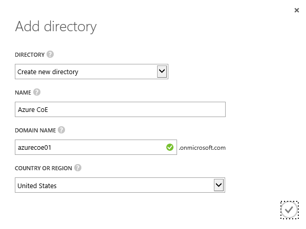
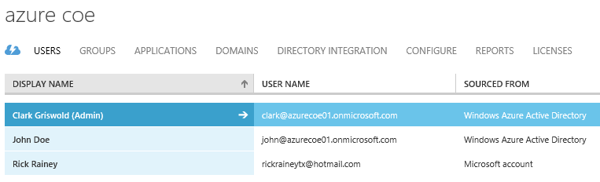
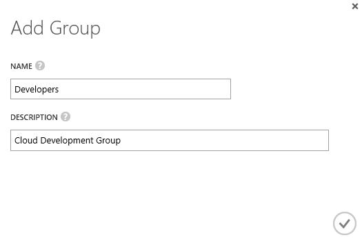
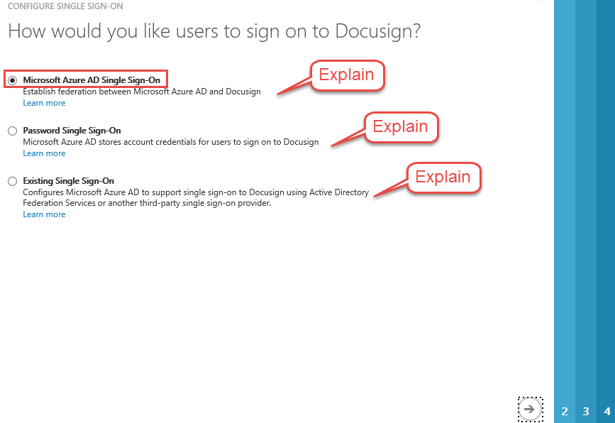
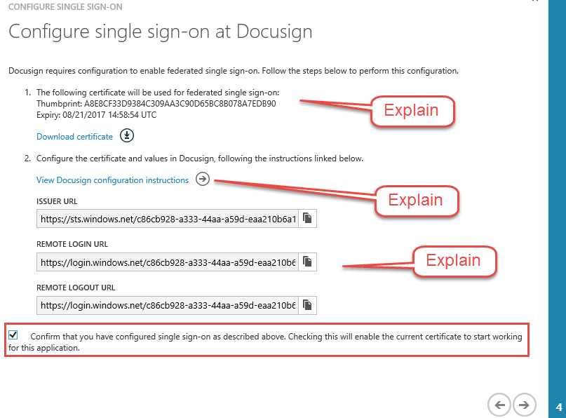
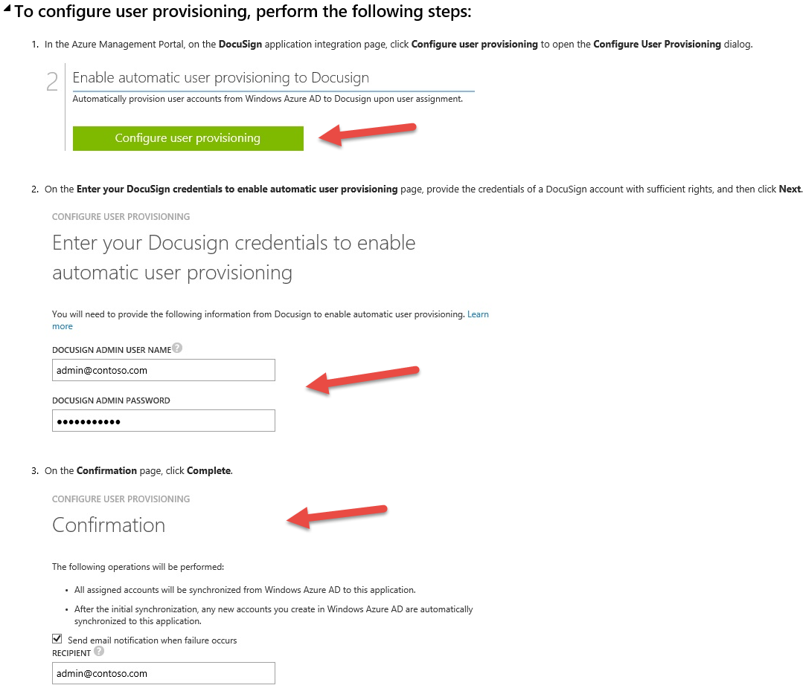
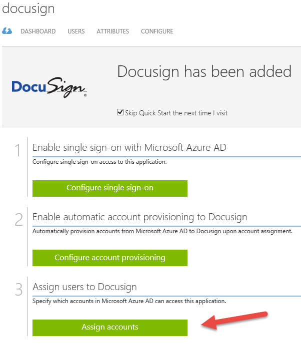
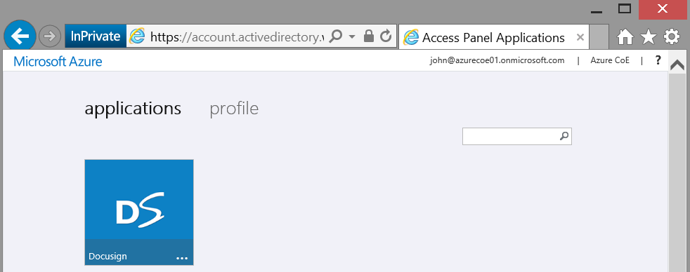
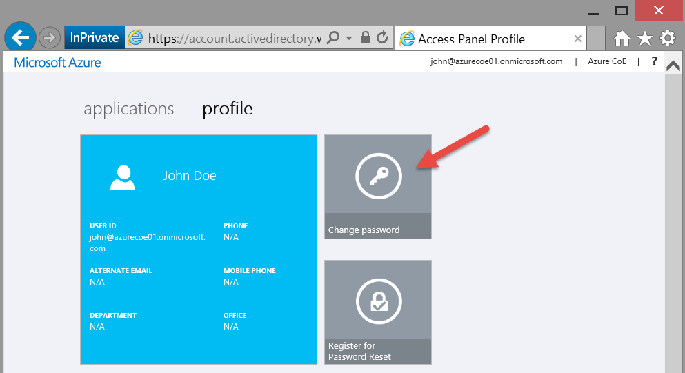

This guide provides steps to setup and demonstrate the application integration capabilities of Azure AD with 3rd party SaaS applications.

Pre-Requisites
--------------

This section lists the pre-requisites required for this demonstration.

-   An Azure subscription

Setup
-----

*Estimated time: 15 minutes*

1.  Sign-in to the Azure Management Portal at <https://manage.windowsazure.com>.

2.  Select **+NEW &gt; APP SERVICES &gt; ACTIVE DIRECTORY &gt; DIRECTORY &gt; CUSTOM CREATE**.

    1.  Set DIRECTORY to **Create new directory**.

    2.  Set Name to **Azure CoE**.

    3.  Set DOMAIN NAME to **azurecoe01**. If that name is not available, increment the number at the end until you find one that is.

    4.  Set COUNTRY to the country you will be presenting in.

1.  Click on the check mark to create the directory.

<!-- -->

1.  In the ACTIVE DIRECTORY page, click on the **Azure CoE** directory.

2.  Click on the **USERS** tab at the top of the page.

3.  Click on **ADD USER** at the bottom of the page.

    1.  Set TYPE OF USER to **New user in your organization**.

    2.  Set USER NAME to **john**.

    3.  Click the right-arrow to move to the next page.

    4.  Set FIRST NAME to **John**.

    5.  Set LAST NAME to **Doe**.

    6.  Set DISPLAY NAME to **John Doe**.

    7.  Set ROLE to **User**.

        

    8.  Click the right-arrow to move to the next page.

    9.  Click the green **create** button.

    10. Copy the user name and NEW PASSWORD to Notepad so you can retrieve it later.

    11. Click on the check mark button in the lower right corner.

        

4.  Click on **ADD USER** at the bottom of the page.

    1.  Set TYPE OF USER to **New user in your organization**.

    2.  Set USER NAME to **clark**.

    3.  Click the right-arrow to move to the next page.

    4.  Set FIRST NAME to **Clark**.

    5.  Set LAST NAME to **Griswold**.

    6.  Set DISPLAY NAME to **Clark Griswold (Admin)**.

    7.  Set ROLE to **Global Administrator**.

    8.  Set ALTERNATE EMAIL ADDRESS to *your* Service Administrator credentials (what you use to sign-in to the Azure portals).

    9.  Click the right-arrow to move to the next page.

    10. Click the green **create** button.

    11. Copy the user name and NEW PASSWORD to Notepad so you can retrieve it later.

    12. Click on the check mark button in the lower right corner.

1.  Click on the **GROUPS** tab at the top of the page.

2.  Click the **ADD GROUP** button at the bottom of the page.

    1.  Set NAME to **Developers**.

    2.  Set DESCRIPTION to **Cloud Development Group**.

    3.  Click on the check mark button in the lower right corner.

1.  In the GROUPS page, click on the **Developers** group name.

2.  Click the **ADD MEMBERS** button at the bottom of the page.

3.  Click on **John Doe**.

4.  Click on the check mark button in the lower right corner.

1.  Sign-in to the Access Panel at <https://myapps.microsoft.com>. Hint: Use a new **InPrivate** browser session.

2.  Enter the username and temporary password for **John Doe**. Note: These values were copied into Notepad in previous steps.

3.  Click the **Sign-in** button.

4.  After signing-in using the temporary password, you will be challenged to enter a permanent password. Enter **P@ssword1** for the new permanent password.

5.  Click the **Update password and sign in** button.

6.  In the Access Panel, click on John’s username in the upper-right corner and select **Sign-Out**.

7.  **Repeat** steps 13-18 for the **Clark Griswold** user.

You can close Notepad now that the passwords have been updated.

Demo Steps
----------

*Estimated time: 15 minutes*

1.  Sign-in to the Azure Management Portal at <https://manage.windowsazure.com>.

2.  Click on **ACTIVE DIRECTORY** in the left navigation.

3.  Click on the **Azure CoE** directory name.

4.  Click on the **APPLICATIONS** tab at the top of the page.

5.  Click the **ADD** button at the bottom of the page.Select the option to **Add an application from the gallery**.

    

6.  In the Application Gallery, scroll through the categories of applications that are available. Point out the larger number of SaaS applications in the **All** category (currently ~2,500).

7.  Click on the **Featured Applications** category.

8.  Click on **Docusign**.

    1.  Explain that for all the SaaS applications it is expected that you have an existing subscription and that the subscription typically must be a business or enterprise level subscription. In other words, Azure AD is not going to automatically provision a new subscription with the SaaS provider for you.

    2.  Click the checkmark button to add the application to your directory.

1.  Note: Explain that we’re using Docusign simply because it lights up basically all the configuration options that are possible. So, for the purposes of demonstration, it gives us an opportunity to explain all the configuration settings.

2.  In the Docusign page, explain the following points:

    1.  All that we’ve done so far is register the SaaS application with our directory so we can manage and configure it. It still needs to be configured.

    2.  Be very clear that not all SaaS applications have all 3 steps. For example, the 2nd step to setup automatic account provisioning with the SaaS provider doesn’t apply for some apps.

    3.  For applications added from the gallery, all applications will have step 1. Although, as you will see shortly, the configuration steps to enable SSO will also depend on the SaaS application.

    4.  For applications added from the gallery, all applications will have step 3, which is, assign user access to the SaaS application.

1.  Click on the **Configure single sign-on** button in step 1.

2.  The first page is where you configure how your users will sign-on to Docusign. Docusign supports all 3 options available, which are Azure AD SSO, Password SSO, and Existing SSO (ADFS). Make sure you read the links for each and can articulate the differences, pros and cons for each.

3.  Select the **Microsoft Azure AD Single Sign-On** radio button.

1.  Click the right-arrow to advance to the next page.

2.  In the Configure App Settings page…

    1.  Set the **SIGN ON URL** to **https://azurecoe.docusign.net/Member/MemberLogin.aspx?ssoname=azurecoe**. Explain that this is the URL where your Azure AD users will be sent to when signing-in to the application. Also point out that this URL is not a real URL. For example, azurecoe.docusign.net doesn’t really exist. If we had a business account setup with Docusign then we would have a **URL** assigned to us as well and an **ssoname** that we could use.

        It’s OK that we don’t have a real account. We can still show the steps involved in setting this up.

    2.  **Check** the checkbox to **Show advanced settings**. Azure AD will configure the ISSUER URL and REPLY URL automatically. However, if you wanted to change these settings this is where you would. Most people will just use the defaults.

    3.  **Uncheck** the option to **Show advanced settings**.

1.  Click the right-arrow to advance to the next page.

2.  In the Configure single sign-on at Docusign page…

    1.  Point out the certificate that Azure AD generated and the download link. Explain that this certificate is what Azure AD will use to sign the security tokens it issues for Docusign and therefore is used by Docusign to validate security tokens issued by Azure AD. Don’t actually download the certificate though because you won’t be able to do anything with it since you don’t have a Docusign business subscription. Which leads us to the next step (2).

    2.  Point out the Docusign configuration instructions link in step 2. Click on this link to open the instructions. Be sure to point out that these are **Docusign specific instructions** and every application will have its own detailed set of instructions. **Show in Step 8 where the certificate from Azure AD is used during the Docusign setup**. This is evident by the fact that on the left of the Docusign instructions pages are **links to all the other SaaS applications**. Be sure to draw attention to these. Do not close the Docusign instructions page. You will come back to this shortly.

    3.  Finally, point out the URL’s that were generated. These are also used during the Docusign configuration process. Point out that these are just standard endpoints that each Azure AD tenant has and that for this particular application, SAML2 is the protocol endpoint used to integrate with the application. More on this later!

    4.  Click the checkbox to Confirm that you have configured single sign-on as described above.

    5.  Click the right-arrow to advance to the next page.

1.  Click the checkmark button in the SSO confirmation page.

1.  Now you are ready to proceed to **Step 2**, which is, **configure account provisioning**.

    You won’t be able to perform this step since you don’t have a Docusign subscription. However, you can show it. Go back to the Docusign instructions page you opened previously. Scroll down to the section titled **To configure user provisioning, perform the following steps**. Point out that it literally is a just 3 simple steps:

    1.  Click the green button under step 2 in the Azure Management Portal.

    2.  Enter admin credentials for the administrator of the Docusign subscription.

    3.  Confirm.

1.  Go back to the Azure Management portal.

2.  You are now ready to proceed with step 3, which is to assign user access to the Docusign application. Click the **Assign Accounts** button.

1.  In the USERS page, click on **John Doe**.

2.  Click the **ASSIGN** button at the bottom of the page. Show the ACCESS column is updated for John Doe.

1.  Explain the following:

    You have now successfully configured Docusign for your organization. When users access the application, they will be authenticated against Azure AD. After authenticating, Azure AD will issue a security token to the user for this application that is signed using the certificate that it generated for this application. The user will be redirected back to Docusign where the token will be presented. Docusign will then validate that the token is from a trusted identity provider (Azure AD in this case) and that the token was signed by this IdP.

    This leads us into the next part of the demonstration, which is, how do users find and access the application? We’ll cover that next, but let’s pause for a second and see if there are any questions.

2.  Open a new **InPrivate** Browsing window.

3.  Navigate to the Access Panel at <https://myapps.microsoft.com>.

4.  Sign-in as John Doe:

    1.  Username: john@azurecoe01.onmicrosoft.com

    2.  Password: P@ssword1

5.  In the Access Panel you will see the Docusign application.

1.  Users can launch the applications they’ve been given access to by clicking on the application tile. And sense the user is already authenticated, the user will not be challenged for credentials. Azure AD will simply issue a security token for this user to use to access the application.

    Note: This won’t work since we didn’t properly complete the Docusign configuration. But, the point here is that the Access Panel is where users can access their application and launch them.

2.  Click on the **profile** tab at the top of the page.

3.  Click on the **Change Password** tile to show that this is where users can self-service password changes.

1.  In the Change Password page, enter **P@ssword1** for the **Old Password** and enter **P@ssword2** for the **New Password**.

1.  Click **Submit**.

2.  In the upper-right corner of the Access Panel, click on John’s username and select **Sign-out**.

3.  In the Sign-in page choose **Use another account**.

4.  Sign-in as Clark Griswold:

    1.  Username: clark@azurecoe01.onmicrosoft.com

    2.  Password: P@ssword1

5.  Show that the Docusign application is not in Clark’s Access Panel. This is because he was not assigned access to the application.

Clean Up
--------

To clean up after this demo perform the following steps:

1.  Remove the Developers Group.

2.  Remove John Doe and Clark Griswold from the Users.

3.  Remove the Docusign application from the Applications page.

4.  Remove the Azure CoE directory.
