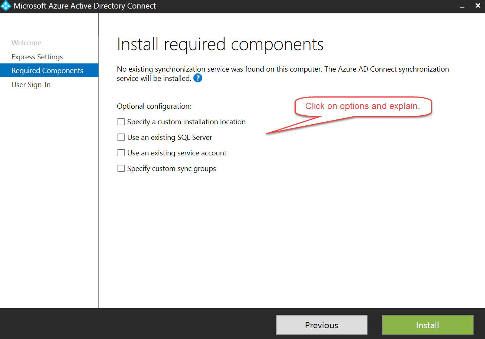
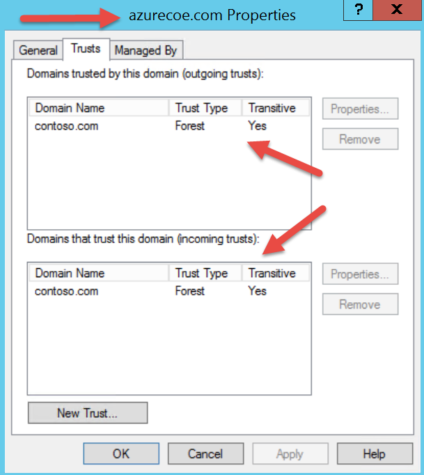
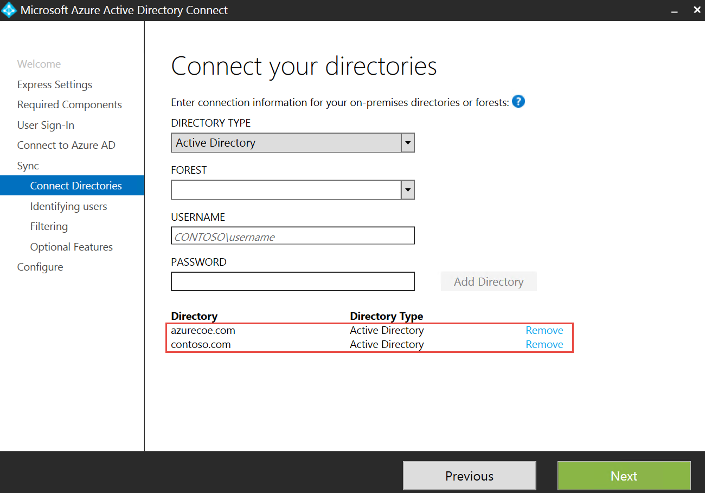
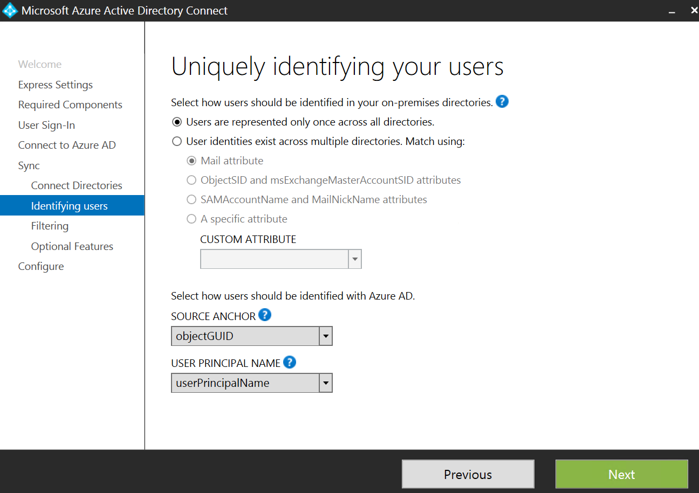
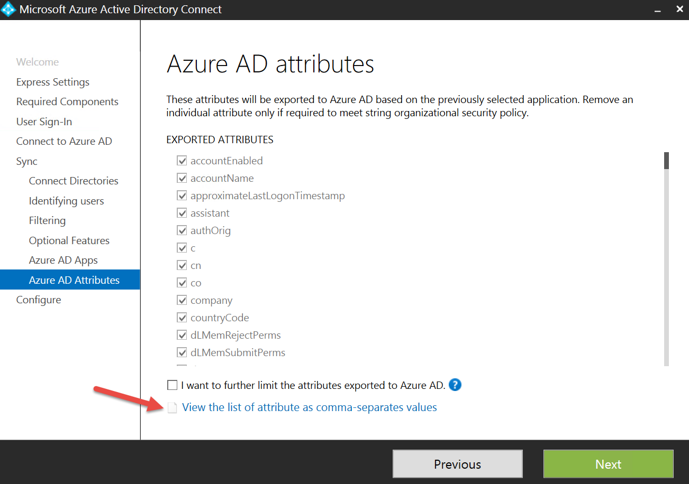
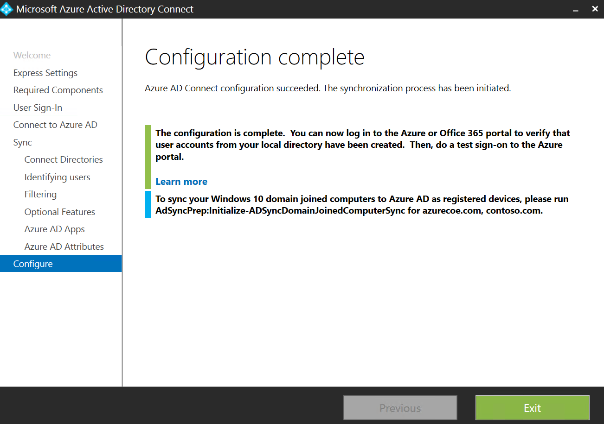

This guide provides setup requirements and steps to demonstrate how to extend an on-premises multi-forest Windows Server Active Directory environment to Azure Active Directory using Azure AD Connect.

Pre-Requisites
--------------

This section lists the pre-requisites required for this demonstration.

-   An Azure subscription

-   You must have completed the Setup section for demo 1. See ***1\_Demo\_App\_Integration.md***.

-   This demo assumes the existence of two Active Directory Forests in the environment, in the following steps the forests are called AzureCatGSI.com and Contoso.com. There should also exist a forest trust between the forests.

Setup
-----

*Estimated time: 10 minutes*

1.  Logon to the classic Azure management portal

2.  Enable Directory Synchronization on the Azure Active Directory you created in the previous example

3.  Download the Azure AD Connect tool to one of the Active Directory domain controllers

Demo Steps
----------

*Estimated time: 15 minutes*

1.  On one of the Active Directory servers install the **Azure AD Connect** tool

2.  In the **Azure AD Connect** installation tool, click **Customize**.

3.  In the Install required components click on a couple of options to show that you can customize the installation of Azure AD Connect. Make sure to **uncheck** any options **before continuing**.

1.  Click **Install**.

2.  While Azure AD Connect is installing, show the trust relationship between the azurecoe.com and contoso.com domains.

    1.  Open **Server Manager** if it is not already opened.

    2.  Click **Tools &gt; Active Directory Domains and Trusts**.

    3.  Right-click **azure.com** and select **Properties**.

    4.  In the **azurecoe.com Properties** window, click on the **Trusts** tab. Explain the trust relationship between the two domain controllers.

    5.  Click **Cancel**.

1.  If Azure AD Connect is still installing, show the users and groups in the azurecoe.com and contoso.com forests.

2.  Go back to Azure AD Connect.

3.  In the User sign-in page, show the sign-in methods that were discussed in the slides. Click on **Federation with AD FS** and explain this configuration option. This is a huge benefit of Azure AD Connect.

1.  Select in **Password Synchronization** and click **Next**.

2.  In the Connect to Azure AD screen, enter the following credentials for the Azure CoE directory:

    1.  Set **USERNAME** to **clark@azurecoe.onmicrosoft.com**

    2.  Set **PASSWORD** to **P@ssword1**

1.  Click **Next**.

2.  In the Connect your directories screen, enter the following:

    1.  Set **FOREST** to **azurecoe.com**

    2.  Set **USERNAME** to **AZURECATGSI.COM\\adminuser**

    3.  Enter password

    4.  Click **Add Directory**.

    5.  Set **FOREST** to **contoso.com**

    6.  Set **USERNAME** to **CONTOSO.COM\\adminuser**

    7.  Enter password

    8.  Click **Add Directory**.

    9.  Click **Next**.

1.  In the Uniquely identifying your users screen, explain some of the options. As an example, Microsoft uses a custom attribute to identify users based on employee Id. Accept the default settings and click **Next**.

1.  In the Filter users and devices screen, set **GROUP** to **Development** for the **contoso.com** forest and click **Resolve**. This will restrict synchronization for this forest to just that group. The azurecoe.com forest will still synchronize all users, groups and devices (the default).

1.  Click **Next**.

2.  In the Optional features screen, select the following options:

    1.  Azure AD App and attribute filtering

    2.  Password writeback

        Note: The options that are grayed out require Azure AD Premium. But, you can still explain what they are for. Don’t select Directory extension attribute sync. If you do, the demo will still work but you will likely get an error message about directory extensions not getting installed which you will have to explain. So, until this bug is fixed, it’s better to just avoid it. But, you can still explain the feature.

        

3.  Click **Next**.

4.  In the Azure AD apps screen, explain that this page exists in the wizard because you selected the optional feature for Azure AD App and attribute filtering. By default, the attributes/claims needed by these applications are synchronized to Azure AD. If you wanted to restrict the attributes that are synchronized to support a specific set of applications, then you could do that here.

1.  Click **Next**.

2.  In the Azure AD attributes screen, explain that these are the attributes that would by default be synchronized based on your selection of the Azure AD apps in the previous screen. If you wanted to further restrict the attributes that are synchronized then you could do that here.

3.  Click the link to view the list of attributes (using Notepad).

4.  Close Notepad.

1.  Click **Next**.

2.  In the Ready to configure page, review the settings with the audience. Explain the checkmark indicating to start the synchronization process after configuring Azure AD Connect.

1.  Click **Install**.

2.  The install will take about 2-3 minutes.

Clean Up
--------

To clean up after this demo perform the following steps:

1.  In the Azure Management Portal, go to the Azure CoE Directory.

    1.  In the DIRECTORY INTEGRATION page, set Directory Sync to DEACTIVATED.

    2.  Click SAVE. Wait for this change to complete before continuing.

    3.  In the USERS page, delete all the users except Clark Griswold (Admin) and your service account user which cannot be deleted anyway.

    4.  In the GROUPS page, delete all the groups.

2.  On your local computer, run PowerShell ISE as Administrator.

    1.  Run the following script. When prompted, sign-in using <clark@azurecoe01.onmicrosoft.com> and password P@ssword1.

        Connect-MsolService

        Get-MsolGroup | Remove-MsolGroup -Force

        Get-MsolServicePrincipal | Remove-MsolServicePrincipal

    2.  You will see some error output. This is a bug and can be ignored.

3.  Go back to the USERS page in the Azure Management portal.

4.  Delete the Clark Griswold user.

5.  Click the back arrow to show all the directories in your subscription.

6.  Highlight Azure CoE and click the DELETE button at the bottom of the screen. More information here. <https://support.microsoft.com/en-us/kb/2967860>
